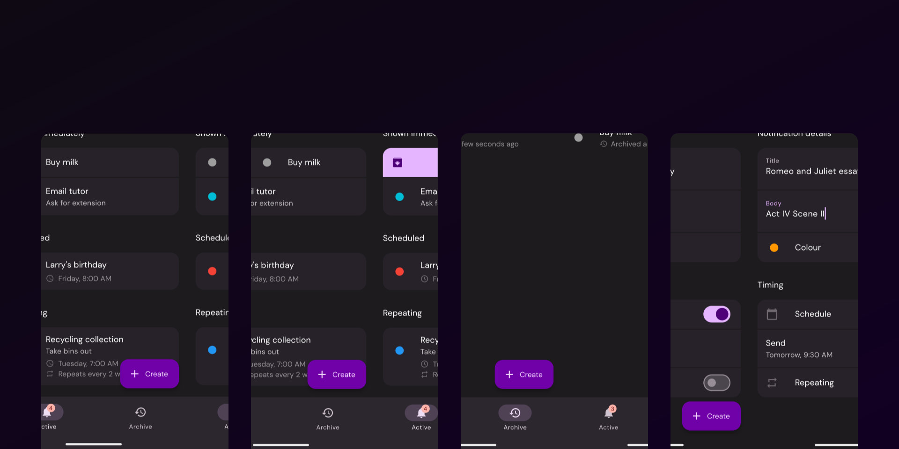

# Noterly
Simple notification reminders for Android devices.

## 📸 Screenshots

## 🗞️ Newly Open-Sourced

Noterly is undergoing a transition from being closed-source to open-source. Please hang tight whilst I set up the repository's open source features (such as issues and pull requests).

## 👇🏻 Download

Noterly is available directly on the [Play Store](https://play.google.com/store/apps/details?id=uk.co.tdsstudios.noterly).

Alternatively, APKs will soon be available directly on the GitHub releases page (keep an eye out!).

## 📝 Features

- ✏️ Create reminders with a title and body text
- ⌚ Send reminders instantly, or schedule them for a specific time
- 🪃 Set reminders to repeat with customisable intervals
- 💤 Snooze reminders for a customisable amount of time
- 🏃🏻‍♀️ Create reminders from a quick settings tile, or share text to Noterly from other apps
- 🎨 Simple Material You UI

## 🔗 Links

- Get Noterly on the [Play Store](https://play.google.com/store/apps/details?id=uk.co.tdsstudios.noterly)
- Check out [Noterly's landing page](https://noterly.tdsstudios.co.uk) on the TDS Studios website
- Watch the [YouTube video](https://youtu.be/7qwUOWT9QbA) on how I created Noterly
- Visit my [personal website](https://www.tomchapman.dev) to see what else I'm working on
- If you need, [Noterly's privacy policy](https://www.tdsstudios.co.uk/privacy#noterly) is available on the TDS Studios website

## 🌍 Translations

> ⏸️ Translations are currently paused whilst I migrate to a new system. Please hang tight, it shouldn't be too long!

Noterly is currently available in the following languages:

- English (GB and US)
- French
- Spanish
- German
- Russian
- Ukrainian
- Polish
- Italian

## ⚠️ Issues

If you find any bugs or issues, please [open an issue](https://github.com/tomc128/noterly/issues/new) on GitHub.

Familiar with Flutter? Feel free to submit a pull request!
